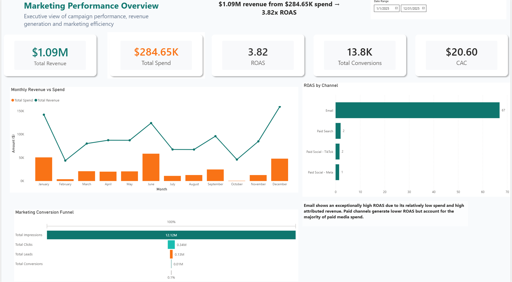
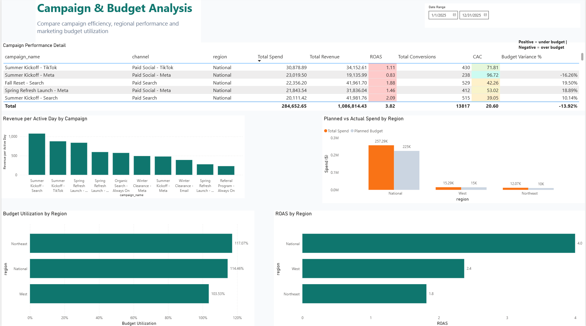
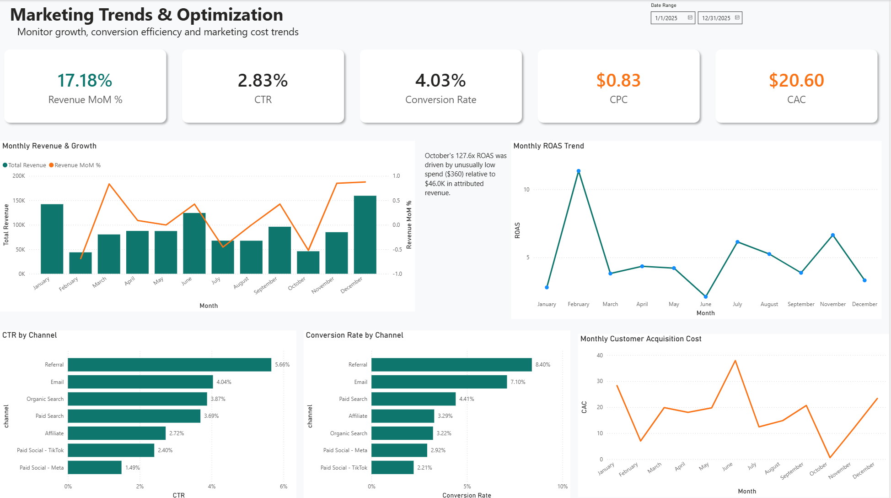

# Solstice Activewear — Marketing Analytics Dashboard

A Power BI dashboard analyzing a year of marketing campaign performance for Solstice Activewear, a fictional direct-to-consumer athletic apparel brand — from raw, intentionally messy data through cleaning, modeling, and a 3-page interactive report.

## Overview

This project analyzes a full year (2025) of marketing performance for Solstice Activewear, which runs campaigns across seven channels — Paid Search, Paid Social (Meta), Paid Social (TikTok), Email, Affiliate, Organic Search, and Referral. The goal: figure out which channels and campaigns are actually driving efficient growth, where budget is being over- or under-spent, and what's behind the swings in performance across the year — then turn that into a report a marketing lead could act on.

## Dataset

The dataset was custom-generated rather than sourced from Kaggle, so the cleaning and analysis here reflects original problem-solving rather than a dataset already used in hundreds of other portfolios. All data is synthetic and does not represent a real company. It ships as three related tables:

| Table | Rows | Description |
|---|---|---|
| `Campaigns` | 35 | Campaign metadata — channel, objective, target segment, region, flight dates, planned budget |
| `Daily_Performance` | ~1,900 | Daily impressions, clicks, leads, conversions, spend, and revenue per campaign |
| `Date_Dimension` | 365 | Standard calendar table for time intelligence |

It was also built with realistic, intentional data quality issues — inconsistent channel labels, missing values, duplicate rows, outliers, and numbers stored as text — to mirror what a real marketing data export looks like before anyone's cleaned it.

## Data Cleaning (Power Query)

- Standardized channel labels across the Campaigns table — caught and fixed inconsistent variants (including a lowercase `tiktok` entry that was silently splitting TikTok's performance across two categories in the channel-level charts)
- Converted the spend column from a mix of numbers and currency-formatted text into a clean decimal type
- Removed duplicate daily performance rows
- Investigated outlier and negative spend values, distinguishing likely ad-platform credits from data entry errors
- Validated logical constraints (e.g., clicks never exceeding impressions) and resolved the rows that failed
- Reviewed blank `end_date` and `planned_budget` values and decided how each should be handled

## Data Model

- `Campaigns[campaign_id]` → `Daily_Performance[campaign_id]` (one-to-many)
- `Date_Dimension[date]` → `Daily_Performance[date]` (one-to-many)
- `Date_Dimension` marked as the official Date Table, with `month_name` sorted by `month_num` for correct chronological ordering in visuals

## Key Metrics (DAX)

```
Total Impressions, Total Clicks, Total Leads, Total Conversions,
Total Spend, Total Revenue, CTR, Conversion Rate, CPC, Cost per Lead,
CAC, ROAS, Budget Utilization, Revenue MoM %
```

## Report Pages

**Page 1 — Marketing Performance Overview**
Executive snapshot: total spend / revenue / ROAS / CAC / conversions, monthly revenue vs. spend, ROAS by channel, and the full conversion funnel from impressions to purchase.

**Page 2 — Campaign & Budget Analysis**
Campaign-level detail: full campaign performance table, revenue per active day (to compare campaigns fairly regardless of how long they ran), and planned-vs-actual budget by region.

**Page 3 — Marketing Trends & Optimization**
Efficiency over time: month-over-month revenue growth, CTR and conversion rate by channel, and monthly CAC and ROAS trends.

## Key Findings

- Email and the unpaid channels (Organic, Referral) return dramatically higher ROAS than paid social or paid search — expected, since they carry little to no media spend. The more useful comparison is *within* the paid channels: TikTok, Meta, and Search cluster in a similar, thinner ROAS range, meaning channel choice among the paid options matters less than campaign-level execution.
- ROAS spikes whenever there's a gap in the paid campaign calendar, not because performance genuinely improved. Both February and October show this pattern: while paid campaigns are between flights, the always-on, low-cost channels keep running and pull the blended ratio up toward their baseline. It's a recurring pattern tied to campaign scheduling, not a one-off anomaly — worth flagging to whoever owns the calendar.
- Ranking campaigns by raw revenue overstates the three always-on programs, which have had all year to accumulate revenue against campaigns that ran for only a few weeks. Revenue per active day is a fairer comparison and surfaces a different set of top performers.
- All three regions are over their planned budget for the year (Northeast the most, at 117% utilization), while regional ROAS comparisons are confounded by channel mix — "National" includes the free channels that the Northeast/West splits don't, so it isn't a like-for-like read on geography.

## Tools & Skills

Power BI (Power Query, data modeling, DAX), M language, star-schema data modeling, KPI design, marketing analytics

## Getting Started

1. Download `solstice_activewear_marketing_data.xlsx`
2. In Power BI Desktop: Get Data → Excel → load all three tables → Transform Data
3. Follow the data model and measures above to reproduce the report, or open the included `.pbix` directly

## Files

- `solstice_activewear_marketing_data.xlsx` — the raw, uncleaned dataset
- `solstice_activewear_dashboard.pbix` — the Power BI report
- `screenshots/` — page exports (see below)

## Screenshots




